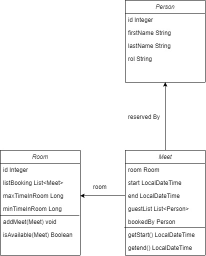

# BookingApp Challenge


## A)
Create	the	domain	model	diagram	with	all	the	possible	entities,	its	attributes
and	relationships




## B)
Deliver	diagrams	of	the	user	interface for	each	step	of	a	booking	process.

```text
Was made in figma, follow the next link:
```
[Figma BookingApp](https://www.figma.com/proto/krpn7obnhgX2Kt6h5deXNT/Untitled?node-id=1%3A2&scaling=scale-down&page-id=0%3A1&starting-point-node-id=1%3A2)

## C)
Considering	that	meetings	cannot	last	less	than	15 minutes	and	more	than	3
hours,	also	meetings	cannot	overlap	with	each	other in	the	same	room,	deliver
the	validation	method	that	is	in	charge	to	verify	these	rules.
```java
public class BookingServiceImpl implements BookingService {

    private final MeetRepository meetRepository = MeetRepository.getInstance();

    /**
     * Logic for duration of the meet, and check if is available the room in that time.
     * @param meet meet for adding.
     * @param room room to add the meet.
     */
    @Override
    public void addMeet(Meet meet, Room room) {
        Long duration = ChronoUnit.MINUTES.between(meet.getStart(), meet.getEnd());
        if (duration > room.getMinTimeInRoom() && duration < room.getMaxTimeInRoom()) {
            meetRepository.addMeet(meet);
            addMeetToRoom(meet, room);
        } else {
            throw new TimeErrorException("Duration not supported by the room");
        }
    }

    /**
     * Check if the room is available in the time of the meet
     * @param newMeet new meet for adding.
     * @param room room to add the meet.
     */
    private void addMeetToRoom(Meet newMeet, Room room) {
        for (Meet meet : room.getMeetList()) {
            if(((newMeet.getStart().isAfter(meet.getStart()) || newMeet.getStart().isEqual(meet.getStart()))
                    && (newMeet.getEnd().isBefore(meet.getEnd()) || newMeet.getEnd().isEqual(meet.getEnd())))) {
                throw new TimeErrorException("Room is not available at that time");
            }
        }
        room.addMeet(newMeet);
    }
}
```
